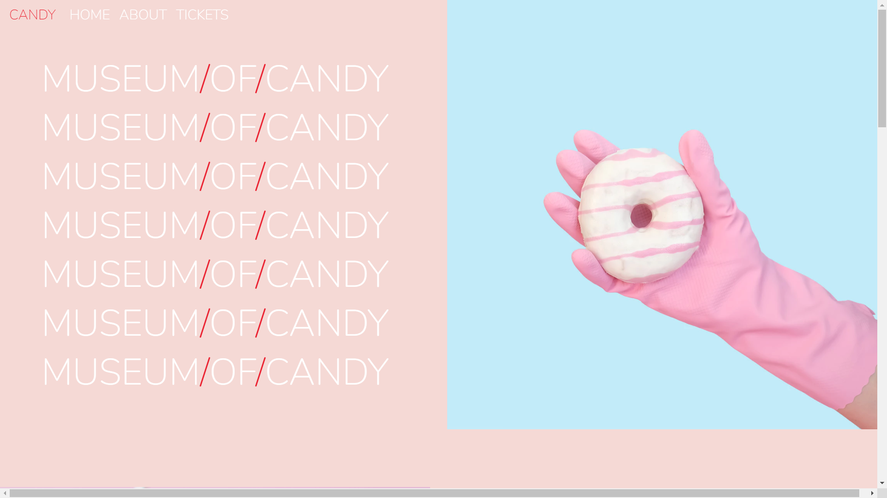
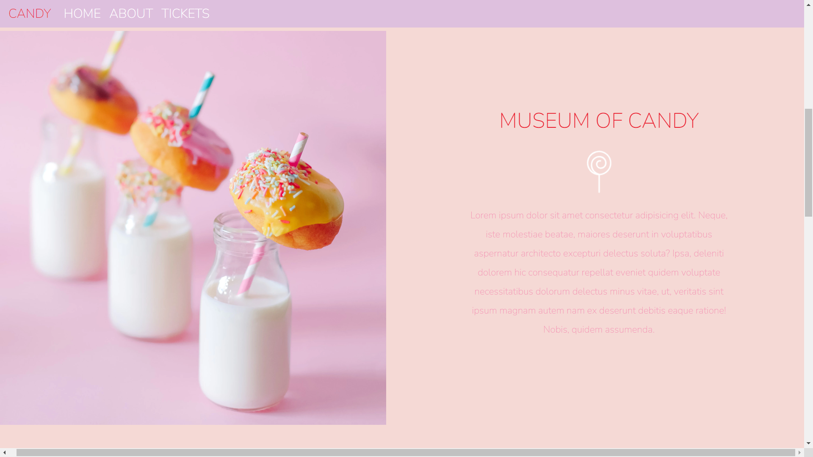

# 🍭 Museum of Candy

Welcome to the **Museum of Candy**, a whimsical web application that presents an imaginary museum dedicated to all things candy! 🍬 This frontend project showcases various exhibits, providing visitors with a **sweet** and engaging experience. 🍫

---

## 🍬 Features

- **Responsive Design** 📱: Built with Bootstrap for a seamless experience across all devices—desktop, tablet, or mobile!
- **Interactive Navigation** 🚪: Easily move through the museum's exhibits with sections like Home, About, and Tickets.
- **Visually Appealing** 🎨: Designed to be as eye-catching as a candy store window, with vibrant colors and fun images.

---

## 💻 Technologies Used

- **HTML** 🏗️: The foundation of the website, providing structure to each page.
- **CSS** 🎨: Custom styles that enhance the design, making it a treat for the eyes.
- **Bootstrap** 📱: Framework for ensuring responsiveness and beautiful layouts.
- **Google Fonts** ✍️: Handpicked fonts to give the site a modern and playful look.

---

## 🗂️ Structure

The project consists of the following files:

- `index.html` 🎟️: The main HTML file containing the structure of the museum's homepage.
- `app.css` ✨: Custom CSS for the project, adding unique candy-themed styling.
- **Images** 📸: Bright and colorful images sprinkled throughout the site to enhance the experience.

---

## 🛠️ How It Works

1. **HTML Structure** 🏛️: The site uses semantic HTML, ensuring it's easy to navigate and search engine friendly.
2. **Styling** 🍬: Custom styles in the `app.css` file bring the candy-themed design to life.
3. **Responsive Features** 📱: Using Bootstrap's grid system and utilities, the site adapts perfectly to different screen sizes.

---

## 🚀 Usage

To explore the **Museum of Candy**, simply open the `index.html` file in any web browser. Use the navigation bar at the top to move through different sections of the museum.

---

## 📸 Screenshots

### 🍫 1️⃣ Homepage

---
This project is a fun display of creativity and web development skills, using **HTML**, **CSS**, and **Bootstrap** to create a candy-themed experience that's as delightful as the treats it represents! 🍩🍪
